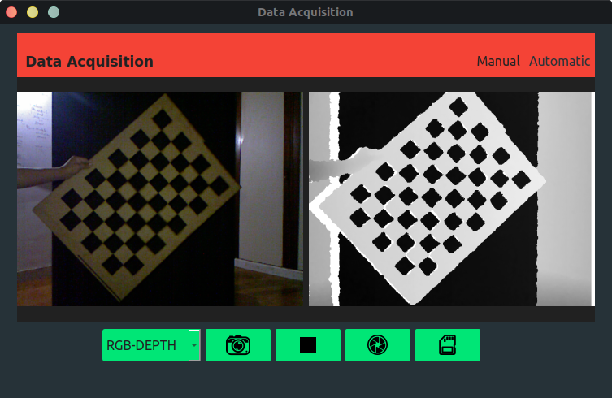
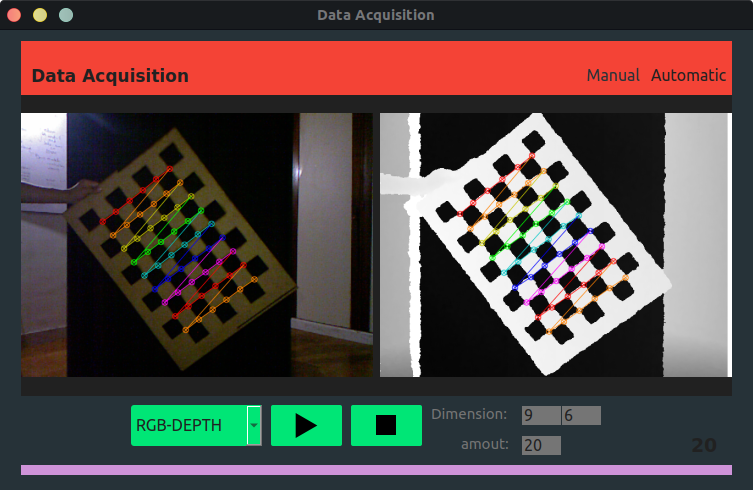

# **Image Acquisition for Extrinsic Calibration**

This is a simple desktop application for manual and automatic acquisition to later perform a stereo calibration between two cameras using Python. In this case, rgb and depth images are acquired, however this application can be used for any pair of cameras as long as the appropriate calibration pattern is available.
The pair of images for which the pattern is detected are automatically saved in the path chosen by the user.
## Manual Acquisition


## Automatic Acquisition


## Dependencies
This project needs **[libfreenect](https://github.com/OpenKinect/libfreenect)** on your computer to enter the microsoft kinect camera. If you are using a different camera you need to modify the file **src/ models/DataAcquisition.py** and ready, you can use the application.

## Project Setup
```
    pip install -r requirements.txt
```
## Run Project
```
    python ExtrinsicAcquisitionWidget.py
```

